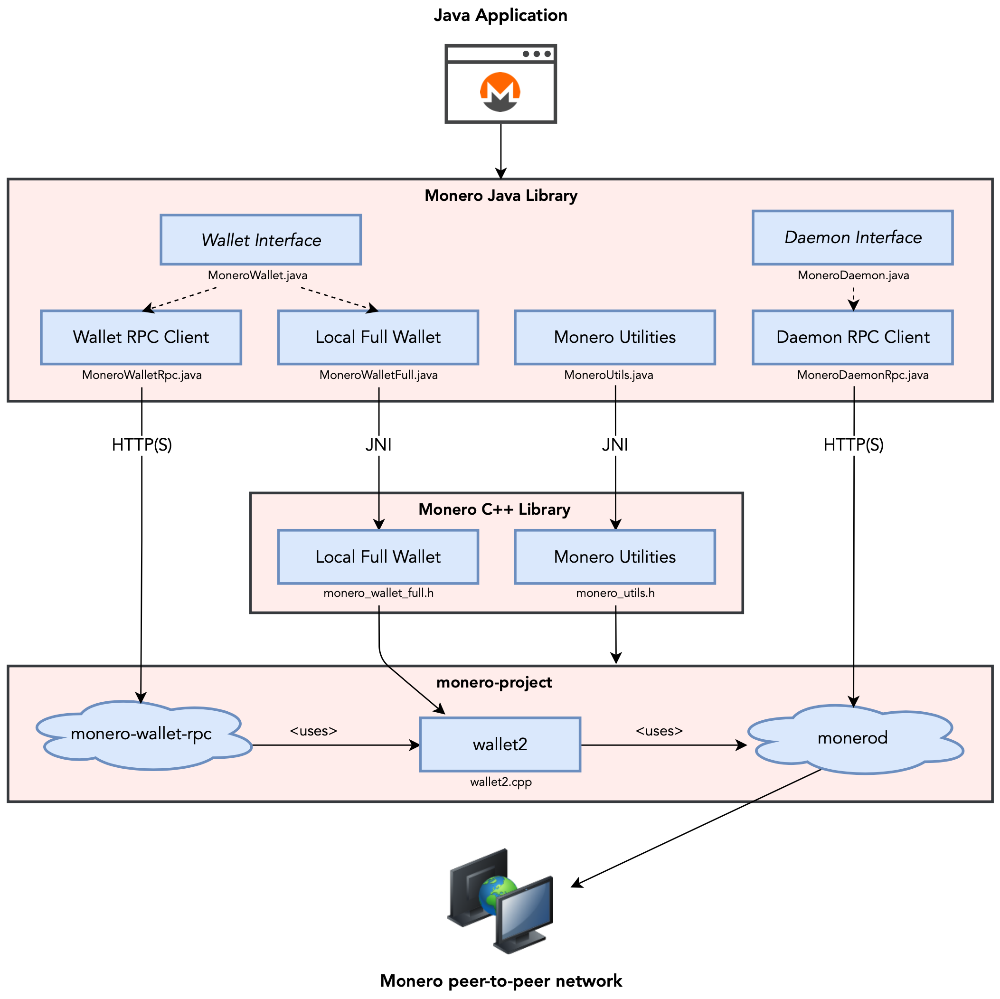

# Monero Java Library

A Java library for creating Monero applications using RPC and JNI bindings to [monero v0.18.1.0 'Flourine Fermie'](https://github.com/monero-project/monero/tree/v0.18.1.0).

* Supports wallet and daemon RPC clients.
* Supports client-side wallets using JNI bindings.
* Supports multisig, view-only, and offline wallets.
* Wallet types are interchangeable by conforming to a [common interface](https://moneroecosystem.org/monero-java/index.html?monero/wallet/MoneroWallet.html).
* Uses a clearly defined [data model and API specification](https://moneroecosystem.org/monero-java/monero-spec.pdf) intended to be intuitive and robust.
* Query wallet transactions, transfers, and outputs by their properties.
* Fetch and process binary data from the daemon (e.g. raw blocks).
* Receive notifications when blocks are added to the chain or when wallets sync, send, or receive.
* Over 280 passing JUnit tests.

## Table of contents

* [Architecture](#architecture)
* [Sample code](#sample-code)
* [Documentation](#documentation)
* [Using monero-java in your project](#using-monero-java-in-your-project)
* [Building JNI shared libraries from source](#building-jni-shared-libraries-from-source)
* [Running JUnit tests](#running-junit-tests)
* [Related projects](#related-projects)
* [License](#license)
* [Donations](#donations)

## Architecture

<p align="center">
	<br>
	<i>Build Java applications using RPC or JNI bindings to <a href="https://github.com/monero-project/monero">monero-project/monero</a>.  Wallet implementations are interchangeable by conforming to a common interface, <a href="https://moneroecosystem.org/monero-java/index.html?monero/wallet/MoneroWallet.html">MoneroWallet.java</a>.</i>
</p>

## Sample code

```java
// connect to daemon
MoneroDaemon daemon = new MoneroDaemonRpc("http://localhost:38081", "superuser", "abctesting123");
long height = daemon.getHeight();                       // 1523651
BigInteger feeEstimate = daemon.getFeeEstimate();       // 1014313512
List<MoneroTx> txsInPool = daemon.getTxPool();          // get transactions in the pool

// open wallet on monero-wallet-rpc
MoneroWalletRpc walletRpc = new MoneroWalletRpc("http://localhost:38083", "rpc_user", "abc123");
walletRpc.openWallet("sample_wallet_rpc", "supersecretpassword123");
String primaryAddress = walletRpc.getPrimaryAddress();  // 555zgduFhmKd2o8rPUz...
BigInteger balance = walletRpc.getBalance();            // 533648366742
List<MoneroTxWallet> txs = walletRpc.getTxs();          // get transactions containing transfers to/from the wallet

// create wallet from mnemonic phrase using JNI bindings to monero-project
MoneroWalletFull walletFull = MoneroWalletFull.createWallet(new MoneroWalletConfig()
        .setPath("sample_wallet_full")
        .setPassword("supersecretpassword123")
        .setNetworkType(MoneroNetworkType.STAGENET)
        .setServerUri("http://localhost:38081")
        .setServerUsername("superuser")
        .setServerPassword("abctesting123")
        .setMnemonic("hefty value scenic...")
        .setRestoreHeight(573936l));

// synchronize the wallet and receive progress notifications
walletFull.sync(new MoneroWalletListener() {
  @Override
  public void onSyncProgress(long height, long startHeight, long endHeight, double percentDone, String message) {
    // feed a progress bar?
  }
});

// synchronize in the background every 5 seconds
walletFull.startSyncing(5000l);

// receive notifications when funds are received, confirmed, and unlocked
walletFull.addListener(new MoneroWalletListener() {
  @Override
  public void onOutputReceived(MoneroOutputWallet output) {
    BigInteger amount = output.getAmount();
    String txHash = output.getTx().getHash();
    Boolean isConfirmed = output.getTx().isConfirmed();
    Boolean isLocked = output.getTx().isLocked();
    FUNDS_RECEIVED = true;
  }
});

// send funds from RPC wallet to full wallet
MoneroTxWallet createdTx = walletRpc.createTx(new MoneroTxConfig()
        .setAccountIndex(0)
        .setAddress(walletFull.getAddress(1, 0))
        .setAmount("250000000000") // send 0.25 XMR (denominated in atomic units)
        .setRelay(false)); // create transaction and relay to the network if true
BigInteger fee = createdTx.getFee(); // "Are you sure you want to send... ?"
walletRpc.relayTx(createdTx); // relay the transaction

// recipient receives unconfirmed funds within 5 seconds
TimeUnit.SECONDS.sleep(5);
assertTrue(FUNDS_RECEIVED);

// save and close wallet
walletFull.close(true);
```

## Documentation

* [Javadoc](https://moneroecosystem.org/monero-java/allclasses.html)
* [API and model overview with visual diagrams](https://moneroecosystem.org/monero-java/monero-spec.pdf)
* [JUnit tests](src/main/test/java/test)
* [monero-javascript documentation](https://github.com/monero-ecosystem/monero-javascript#documentation) provides additional documentation which translates to monero-java

## Using monero-java in your project

#### For Maven, add to pom.xml:

```xml
<dependency>
  <groupId>io.github.monero-ecosystem</groupId>
  <artifactId>monero-java</artifactId>
  <version>0.7.4</version>
</dependency>
```

#### For Gradle, add to build.gradle:

`compile 'io.github.monero-ecosystem:monero-java:0.7.4'`

You are now ready to use this library with [monero-daemon-rpc](https://getmonero.org/resources/developer-guides/daemon-rpc.html) and [monero-wallet-rpc](https://getmonero.org/resources/developer-guides/wallet-rpc.html) endpoints.

If you want to use client-side wallets via native JNI bindings, first [build the JNI shared libraries](#building-jni-shared-libraries-from-source).

#### If using RPC servers:

1. Download and install [Monero CLI](https://web.getmonero.org/downloads/).
2. Start monero-daemon-rpc, e.g.: `./monerod --stagenet` (or use a remote daemon).
3. Start monero-wallet-rpc, e.g.: `./monero-wallet-rpc --daemon-address http://localhost:38081 --stagenet --rpc-bind-port 38083 --rpc-login rpc_user:abc123 --wallet-dir ./`

## Building JNI shared libraries from source

If you want to process binary data or use a client-side wallet instead of RPC, shared libraries must be built for your specific platform for this Java library to use.  This project uses a C++ counterpart library, [monero-cpp](https://github.com/monero-ecosystem/monero-cpp), to support JNI, which is included as a submodule in ./external/monero-cpp.

1. Install maven and Java JDK for your system<br>
 Ubuntu: `sudo apt-get install maven default-jdk`<br>
 Mac: `brew install maven openjdk`
2. `export JAVA_HOME=/path/to/jdk`, for example:<br>
 Ubuntu: `export JAVA_HOME=/usr/lib/jvm/default-java`<br>
 Mac: `export JAVA_HOME=/Library/Java/JavaVirtualMachines/adoptopenjdk-11.jdk/Contents/Home`
2. Clone the project repository: `git clone https://github.com/monero-ecosystem/monero-java.git`
3. `cd ./monero-java`
3. Install Maven dependencies: `mvn install`
4. Update submodules: `./bin/update_submodules.sh`
5. [Build ./external/monero-cpp as a shared library.](https://github.com/monero-ecosystem/monero-cpp#using-this-library-in-your-project)
7. Build shared libraries to ./build/: `./bin/build_libmonero_java.sh`
8. Run TestMoneroUtils.java JUnit tests to verify the shared libraries are working with Java JNI.
9. Add the shared libraries within ./build/ to your application's classpath.

## Running JUnit tests

1. Clone the project repository: `git clone https://github.com/monero-ecosystem/monero-java.git`
2. `cd monero-java`
3. If using JNI, [build JNI shared libraries from source](#building-jni-shared-libraries-from-source).
3. Start RPC servers:
	1. Download and install [Monero CLI](https://web.getmonero.org/downloads/).
	2. Start monero-daemon-rpc, e.g.: `./monerod --stagenet` (or use a remote daemon).
	3. Start monero-wallet-rpc, e.g.: `./monero-wallet-rpc --daemon-address http://localhost:38081 --stagenet --rpc-bind-port 38083 --rpc-login rpc_user:abc123 --wallet-dir ./`
4. Configure the appropriate RPC endpoints, authentication, and other settings in [TestUtils.java](src/test/java/utils/TestUtils.java).
4. Run all *.java files in src/main/test as JUnits.

## Related projects

* [monero-javascript](https://github.com/monero-ecosystem/monero-javascript)
* [monero-cpp](https://github.com/monero-ecosystem/monero-cpp)
* [Haveno](https://github.com/haveno-dex/haveno)

## License

This project is licensed under MIT.

## Donations

If this library brings you value, please consider donating.

<p align="center">
	<br>
	<code>46FR1GKVqFNQnDiFkH7AuzbUBrGQwz2VdaXTDD4jcjRE8YkkoTYTmZ2Vohsz9gLSqkj5EM6ai9Q7sBoX4FPPYJdGKQQXPVz</code>
</p>